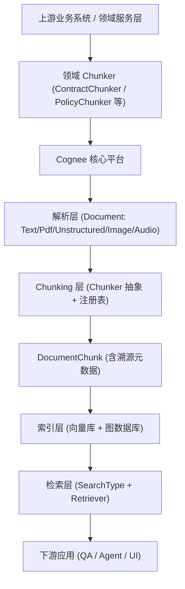

## Cognee 平台 RAG 与 Chunker 扩展架构设计

> 原英文文件名：`COGNEE_RAG_CHUNKER_ARCHITECTURE.md`
>
> 内容与原文件一致，仅将文件名改为中文，便于团队内部沟通与归档。

### 1. 背景与目标

- **平台定位**：Cognee 作为企业级 AI 数据基础平台，核心职责是提供“通用解析 + 切片 + 图与向量索引 + 多种检索模式”的基础能力，而不直接固化合同、制度等具体业务规则。
- **当前诉求**：
  - 在不污染平台内核的前提下，支持 **合同 / 制度条款级检索** 等领域能力；
  - 采用 **方式 A**：平台提供 `Chunker` 扩展点与选择机制，领域服务层提供 `ContractChunker` / `PolicyChunker` 等具体实现。
- **设计原则**：
  - **平台层通用、中立**：不内置合同/制度语义，只提供 Hook；
  - **服务层领域化**：条款识别规则、正则等全部在服务层；
  - **溯源可追踪**：`DocumentChunk` 必须保留足够的原始文件溯源信息，支撑“点击引用 → 回到原文/原图”。

---

### 2. 总体架构概览



- **平台层（C~H）**：由现有 Cognee 代码实现，新增 Chunker 注册/选择机制与溯源字段。
- **服务层（A~B）**：独立于平台仓库，可以是同仓不同模块或业务系统中的一层封装。

---

### 3. 分阶段演进路线（融合 Chunker 扩展方案）

#### 3.1 阶段 0：打通现有 add → cognify → search

- **目标**：在简单文本数据集上，确保:
  - `add` 能写入 `Document`；
  - `cognify` 能完成 chunking + 图 + 向量索引；
  - `search` 的 `CHUNKS / RAG_COMPLETION / GRAPH_COMPLETION` 能正常返回结果。
- **改造量**：只做问题诊断与修复，不引入新概念，保证平台当前能力“正常工作”。

#### 3.2 阶段 1：增强基础模型（中性增强）

- **1.1 DocumentChunk 溯源字段（平台层）**  
  在 `DocumentChunk` 中新增中性字段（示例）：
  - **必选溯源字段**：
    - `source_data_id: UUID | None`（对应 Data.id / 原始文件）
    - `source_file_path: str | None`（原始文件路径或标识）
  - **位置信息字段**：
    - `page_number: int | None`
    - `start_char: int | None`
    - `end_char: int | None`
    - `logical_unit: str | None`（“逻辑单元名”，可由领域层填入条款编号或章节）

- **1.2 Document.read → Chunker 的信息传递**  
  - `PdfDocument.read`：向 Chunker 传入当前 page 和 page 内 offset；
  - `UnstructuredDocument.read`：通过 elements 信息传入“段落/标题”等逻辑标记；
  - `ImageDocument` / `AudioDocument`：在 metadata 中保留 `source_image_id` / `source_audio_id`，避免 OCR/ASR 后丢失原始资源关联。

> 这一阶段只增强“数据模型与溯源能力”，不引入具体合同/制度逻辑。

#### 3.3 阶段 2：Chunker 扩展点与注册机制（平台层）

- **2.1 抽象 Chunker 注册表**

  在平台层新增一个轻量注册表（伪代码示意）：

  ```python
  # chunker_registry.py
  CHUNKER_REGISTRY = {}

  def register_chunker(name: str, chunker_cls: type[Chunker]):
      CHUNKER_REGISTRY[name] = chunker_cls

  def get_chunker(name: str) -> type[Chunker]:
      return CHUNKER_REGISTRY.get(name, TextChunker)
  ```

- **2.2 dataset / pipeline 级 Chunker 选择**

  在 `cognify` 调用 `get_default_tasks` 时，支持从配置中决策 chunker：

  - 依据：
    - `dataset_name` / `dataset_id`
    - pipeline 参数 `chunker_name`
    - 默认值：`TextChunker`

  CLI / API 支持：

  - CLI：增强 `--chunker` 参数（已有 `TextChunker` / `LangchainChunker`），允许自定义名称；
  - `/v1/cognify` 或统一 pipeline 配置中支持传入 `chunker_name`。

> 至此，平台层已经具备“按名称切换 Chunker”的能力，但并不知道“合同”或“制度”的概念。

#### 3.4 阶段 3：领域 Chunker 实现与接入（服务层）

- **3.1 在服务层实现领域 Chunker**

  在业务/服务项目中，实现：

  - `ContractChunker(Chunker)`
  - `PolicyChunker(Chunker)`

  内部逻辑：

  - 使用正则 / 规则识别条款边界（如“第X条”、“1.1”、“1.2”）；
  - 尽量保证“一条 chunk ≈ 一个条款”，并在 chunk 的 metadata 中写入：
    - `logical_unit` = “第 5 条 违约责任” 或对应制度条款标题；
    - `page_number` / `start_char` / `end_char` 等（如果可得）。

- **3.2 在服务层注册 Chunker**

  服务层启动时（或初始化时）调用平台提供的注册方法（示意）：

  ```python
  from cognee.modules.chunking.registry import register_chunker
  from my_domain.chunkers import ContractChunker, PolicyChunker

  register_chunker("ContractChunker", ContractChunker)
  register_chunker("PolicyChunker", PolicyChunker)
  ```

- **3.3 通过配置为 dataset 选择 Chunker**

  使用约定或配置（示例）：

  - 某些 dataset 在创建或接入时配置：
    - `contracts_dataset` → 默认 `chunker_name = "ContractChunker"`
    - `policies_dataset` → 默认 `chunker_name = "PolicyChunker"`

  或在调用 `cognify` 时显式指定：

  - CLI：`cognee-cli cognify --datasets contracts_dataset --chunker ContractChunker`
  - Python（服务层封装）：`await cognify(datasets=[...], chunker=ContractChunker)`

#### 3.5 阶段 4：索引与检索增强（平台层）

- **4.1 向量索引按 dataset/字段细分**

  在 `index_data_points` 中，利用 `source_data_id` / `dataset_id` 做更细粒度的索引或搜索过滤：

  - 可选择：
    - 对不同 dataset 建立物理分库/集合；
    - 或在单集合中使用 payload filter（取决于向量引擎实现）。

- **4.2 引入 hybrid / rerank（可选）**

  在 `ChunksRetriever` 之外，增加 `HybridChunksRetriever` 或 rerank 模块：

  - 先用向量召回 N 条；
  - 再用 BM25 / 关键字召回 M 条；
  - 对候选集合做简单线性融合或交集排序；
  - 如有需要再引入轻量 cross-encoder 做 rerank。

#### 3.6 阶段 5：引用结构与 UI 对接

- **5.1 标准化引用结构（平台层）**

  在 `CombinedSearchResult` 中增加 `references` 字段，元素为：

  - `dataset_id`
  - `source_data_id`
  - `document_name`
  - `page_number`
  - `logical_unit`（条款/章节）
  - `snippet`

  这些字段可以从 `DocumentChunk` 的溯源信息与 metadata 中提取。

- **5.2 前端最小改造（UI 层）**

  在 dataset 搜索页面中：

  - 在每条回答下方渲染 `references` 列表；
  - 展示“来自：某合同 / 第 X 条 / 第 Y 页 / 片段：……”；
  - 点击引用时，调用已有的“选择文件”逻辑，打开对应文件（滚动高亮可后置实现）。

---

### 4. Chunker 扩展机制设计（平台层细化）

#### 4.1 抽象与现有代码的关系

- **已有抽象**：
  - `Chunker`：构造函数与 `read()`；
  - `TextChunker` / `LangchainChunker`：具体实现；
- **新增内容**：
  - Chunker 注册表：负责 `name → Chunker 类` 的映射；
  - Chunker 选择逻辑：
    - 优先级示例：`cognify` 入参 > dataset 配置 > 系统默认。

#### 4.2 配置维度

- **按 pipeline**：某条 pipeline 的所有 dataset 统一使用同一个 Chunker；
- **按 dataset**：不同 dataset 使用不同 Chunker；
- **按数据类型（可选）**：例如 code / 自然语言 / 合同，用不同 Chunker，这一步可以留到后续演进。

---

### 5. 领域 Chunker 实现（服务层细化）

#### 5.1 ContractChunker 示例逻辑（概念）

- **输入**：来自 `PdfDocument` / `UnstructuredDocument` 的 `get_text()` 文本流；
- **处理步骤**：
  - 扫描文本，识别条款标题：
    - 正则匹配 “第 X 条”、“第 X 章”、“Article X”、“1.1”、“1.2”等；
  - 将每个条款段落聚合成一个 chunk：
    - 在 chunk 的 metadata 中标记：
      - `logical_unit = "第 5 条 违约责任"`
      - `page_number`（基于 PdfDocument 提供的页号）
      - `start_char` / `end_char`（在整篇文档中的位置）
- **输出**：`DocumentChunk` 对象流，供后续图构建与索引使用。

#### 5.2 PolicyChunker 类似

- 基于制度/规章文档常见结构（章 / 节 / 条）做识别；
- 在 `logical_unit` 中写入对应章节/条款名。

---

### 6. DocumentChunk 溯源与引用结构

#### 6.1 溯源设计要点

- **必须可回溯到原始文件 / 原图**：
  - `source_data_id`：对应 `Data` 表记录（原始文件）；
  - `source_file_path` / `original_source_path`：原始文件路径或对象存储键；
  - 多模态场景：
    - 对图片/音频类，必须在 OCR/ASR 之后仍保留 `source_image_id` / `source_audio_id` 信息。

#### 6.2 引用结构在检索结果中的体现

- 检索结果（`CombinedSearchResult`）除了 `result` 和 `context` 外，新增 `references` 列表，元素来源自：
  - DocumentChunk 的溯源字段；
  - logical_unit / snippet；
  - dataset 与 data_id 信息。
- UI 可基于 `references` 渲染：
  - “来自：某合同 / 第 X 条 / 第 Y 页 / 片段：……”。

---

### 7. 后续工作建议与使用方式

- **短期（PoC / 内部验证）**：
  - 按上述阶段 0 → 1 → 3 的顺序推进：
    - 先打通现有链路；
    - 补全 DocumentChunk 溯源字段；
    - 在服务层实现并注册 `ContractChunker / PolicyChunker`，通过 CLI / 配置接入。

- **中期（项目试点）**：
  - 在真实合同/制度数据集上验证条款级检索效果；
  - 视需求引入 hybrid / rerank；
  - 将引用结构返回到前端，支持简单的“条款溯源”展示。

- **长期（平台产品化）**：
  - 将 Chunker 注册机制、DocumentChunk 溯源字段、引用结构作为平台“公开能力”文档的一部分；
  - 条款级 Chunker 与领域图谱（合同/制度领域模型）则以“行业解决方案包”的形式维护，与平台内核解耦。
